# Procesverslag
**Auteur:** -Pieter Buur-

Codepen: https://codepen.io/pieterbuur/pens/public?cursor=ZD0wJm89MSZwPTEmdj00NzE3MzIyNQ==

## Bronnenlijst
1. -Flexbox- https://css-tricks.com/snippets/css/a-guide-to-flexbox/
2. -Media queries- https://robinroelofsen.nl/responsive-websites-media-queries
3. -Micro Interactie- https://www.youtube.com/watch?v=xuA83OYTE7I&ab_channel=dcode
4. -2e video Micro Interactie- https://www.youtube.com/watch?v=s_hO8Pn3u5M&t=92s&ab_channel=ProMakerDev

## Eindgesprek (week 7/8)

Tot mijn verbazing is het mij aardig gelukt de feedback van vorige voortgangsgesprekken te verwerken in mijn eindproduct. Wel ben ik niet tevreden over wat kleine vormgevingsfoutjes. Maar toch vind ik het algemene product wel prima.

**Screenshot(s):**

-screenshots van het eindresultaat-

 

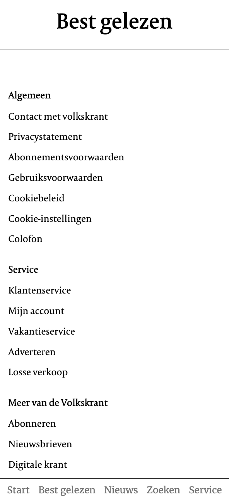

## Voortgang 3 (week 6)

### Stand van zaken

Bij dit gesprek was ik nog niet begonnen met de media queries, wat eigenlijk wel zou moeten. Daarnaast had ik ook nog niet alle 'p'
onder mijn images gestyles. Ook heb ik nog geen animatie. Met deze 3 punten in het achterhoofd ben ik verdergegaan.

**Screenshots:**

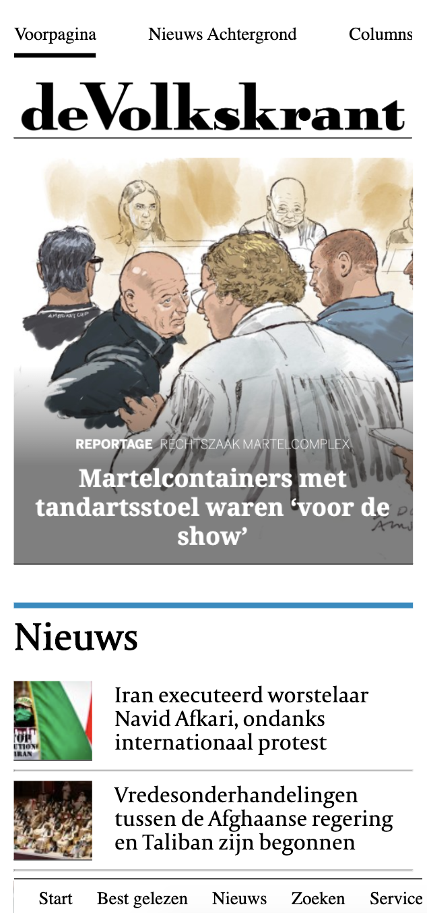
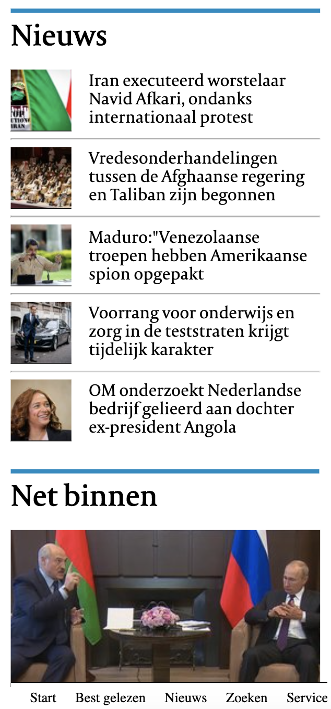
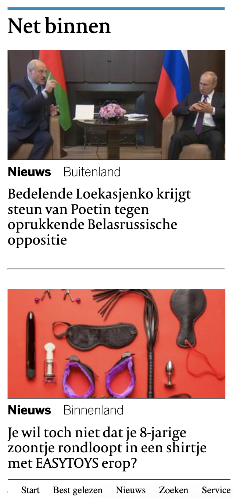
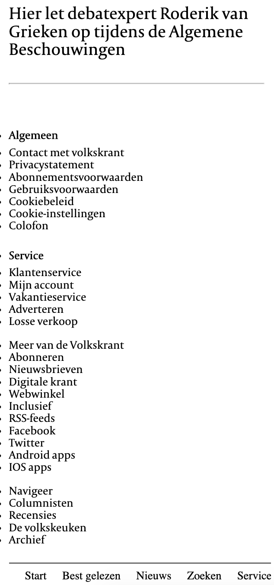

### Agenda voor meeting

Hebben niet met het groepje afgesproken, omdat er geen tijd voor was.

### Verslag van meeting

We hebben deze week geen meeting gehouden.

## Voortgang 2 (week 5)

Bij dit voortgangsgesprek was ik nog niet zo ver met mijn 2e pagina. En had ik mijn 1e pagina nog niet af. Met deze 2 punten in het achterhoofd ben ik verdergegaan.

**Screenshots:**

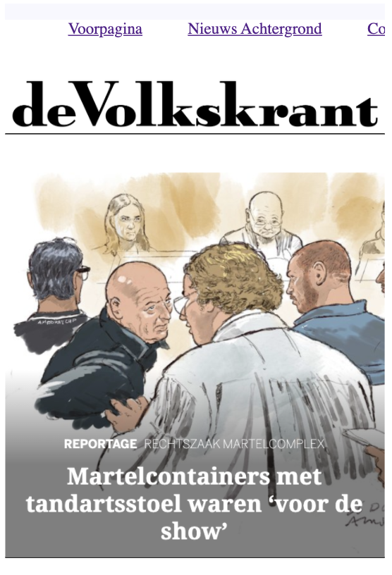
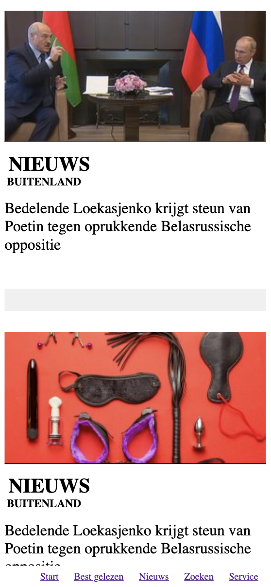
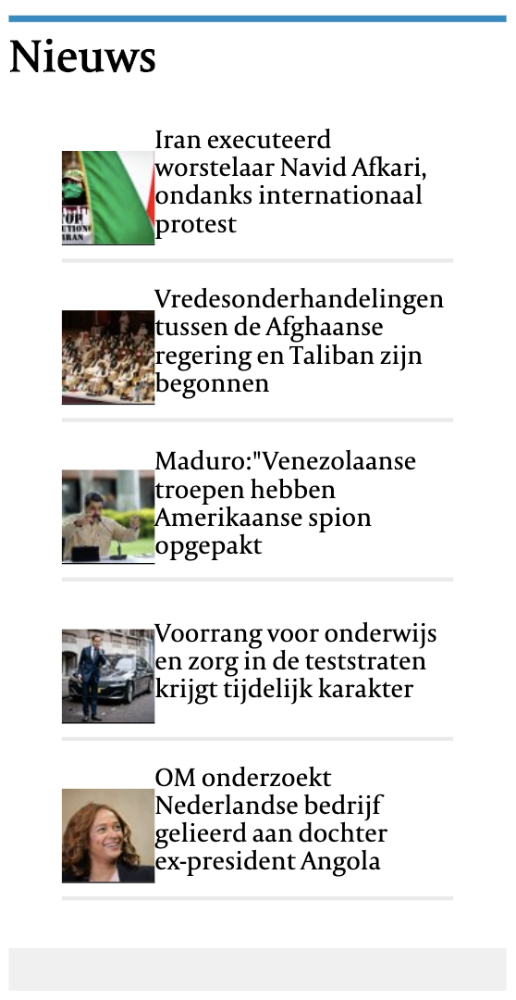
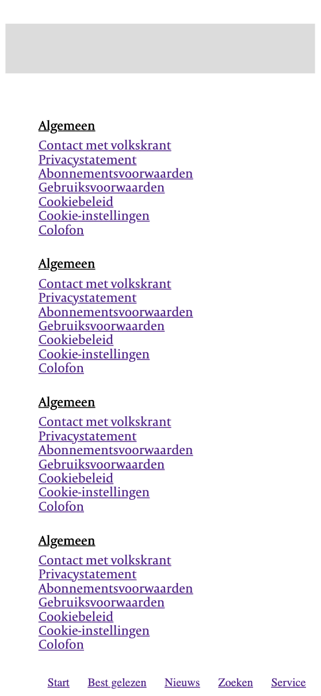

### Agenda voor meeting
Deze week hebben we geen voortgangsgesprekken gehouden, vanwege drukte.

### Verslag van meeting
Geen meeting.

## Voortgang 1 (week 3)

### Stand van zaken

Goed begin gemaakt, al met css begonnen. Er moet nog veel gebeuren.

**Screenshots:**

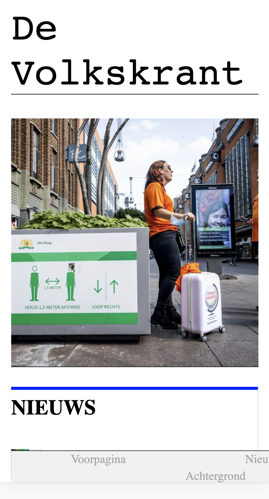
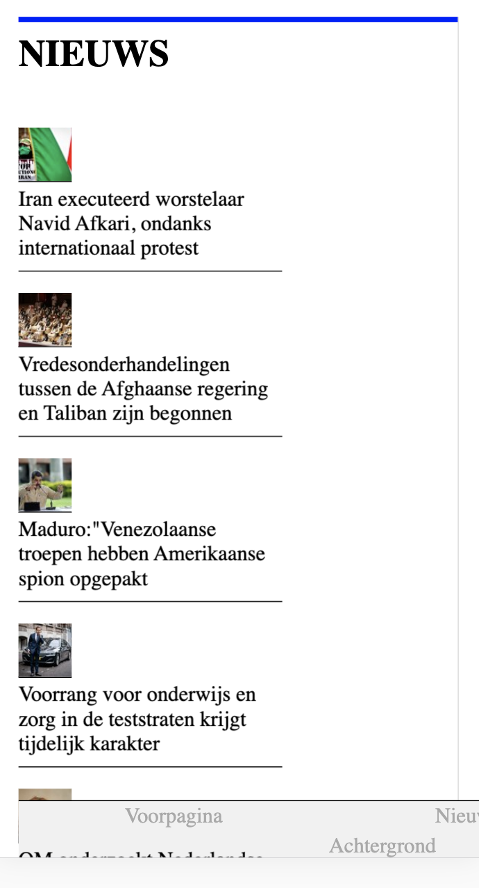

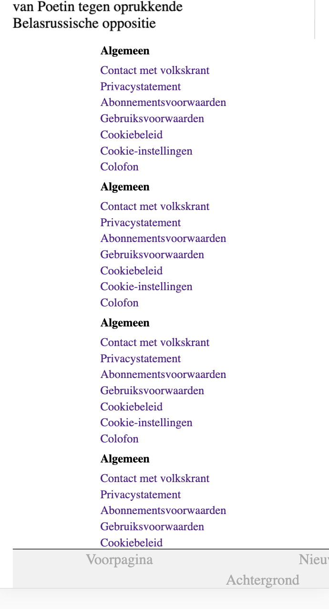

### Agenda voor meeting

18 september groep B2, 9.25. Vanwege drukte met het hele groepje besloten de dag van de feedbackgesprekken zelf te doen.

### Verslag van meeting

Het feedbackgesprek ging goed, alleen er waren wel een paar punten van verbetering:

- Werk je icoontjes uit door de svg te kopiëren van volkskrant.nl
- Gebruik strong en em voor tekst
- Gebruik figures ipv img src voor de artikelen.
    
Het eerste waar ik nu mee aan de slag ga is de homepage verder stylen.

## Intake (week 1)

**Je startniveau:** -blauw-

**Je focus:** -responsive-

**Je opdracht:** -[De website:](https://www.volkskrant.nl/)-

**Screenshots:**

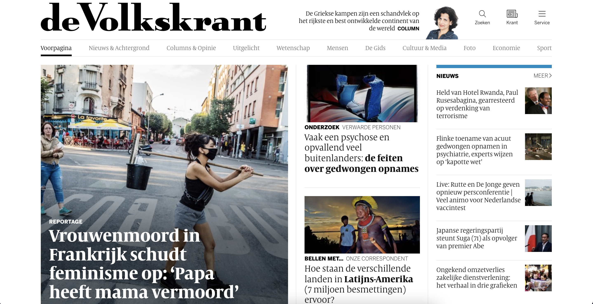
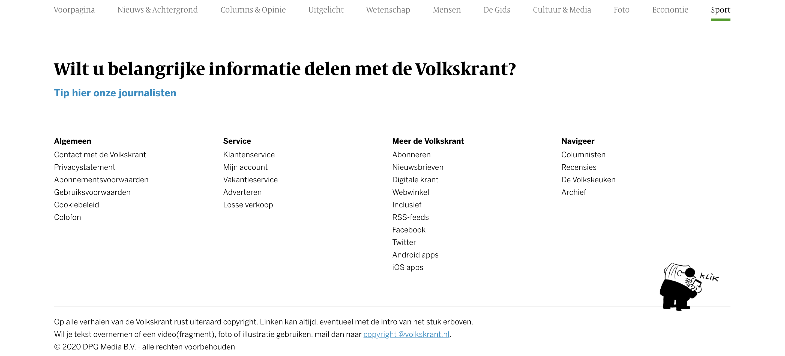

**Breakdown-schetsen:**

![-voorlopige breakdownschets(en) van een of beide pagina's van de site die je gaat maken-]
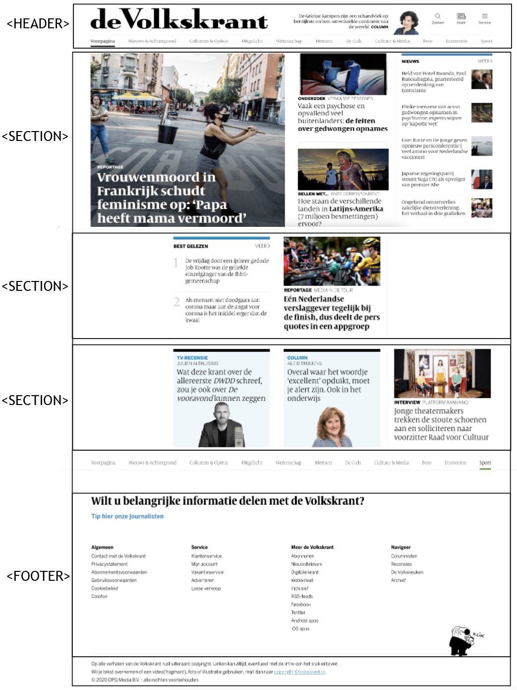
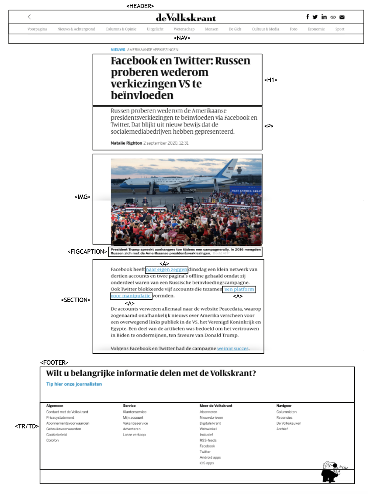
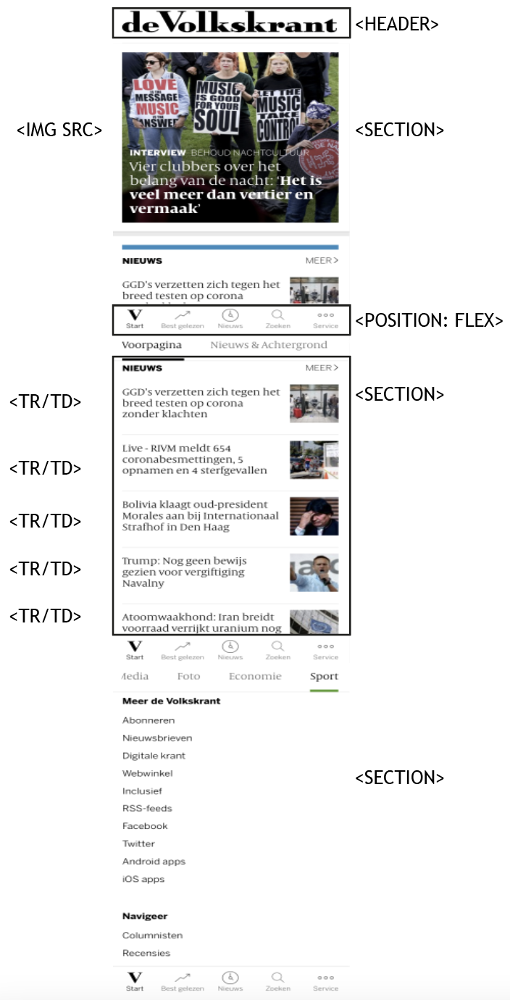

